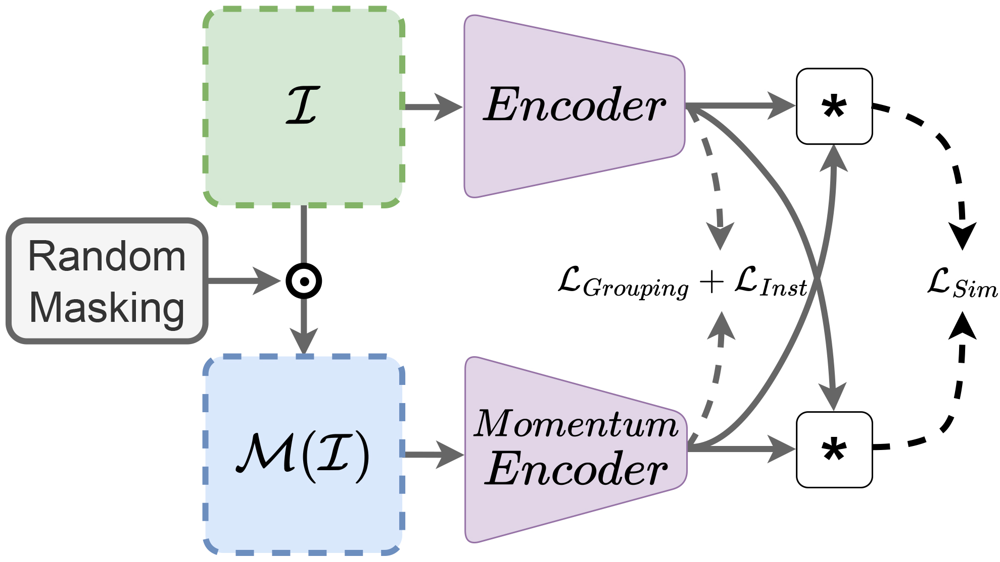

# Contrastive Learning for Lane Detection via Cross-Similarity
>[**Contrastive Learning for Lane Detection via Cross-Similarity**](https://arxiv.org/abs/2308.08242)<br>
>[](https://arxiv.org/abs/2308.08242)

## Overview of CLLD

Contrastive Learning for Lane Detection via cross-similarity (CLLD), is a self-supervised learning method that tackles this challenge by enhancing lane detection models’ resilience to real-world conditions that cause lane low visibility. CLLD is a novel multitask contrastive learning that trains lane detection approaches to detect lane markings even in low visible situations by integrating local feature contrastive learning (CL) with our new proposed operation cross-similarity. To ease of understanding some details are listed in the following:

- CLLD employs similarity learning to improve the performance of deep neural networks in lane detection, particularly in challenging scenarios. 
- The approach aims to enhance the knowledge base of neural networks used in lane detection.
- Our experiments were carried out using `ImageNet` as a pretraining dataset. We employed pioneering lane detection models like  `RESA`, `CLRNet`, and `UNet`, to evaluate the impact of our approach on model performances.

<p align="center">
  <br>
  <i>CLLD architecture</i>
</p>

## Get started
1. Clone the repository
    ```
    git clone https://github.com/sabadijou/clld_official.git
    ```
    We call this directory as `$RESA_ROOT`

2. Create an environment and activate it (We've used conda. but it is optional)

    ```Shell
    conda create -n clld python=3.9 -y
    conda activate clld
    ```

3. Install dependencies

    ```Shell
    # Install pytorch firstly, the cudatoolkit version should be same in your system. (you can also use pip to install pytorch and torchvision)
    conda install pytorch torchvision torchaudio cudatoolkit=11.3 -c pytorch
      
    # Install kornia and einops
    pip install kornia
    pip install einops

    # Install other dependencies
    pip install -r requirements.txt
    ```
## Run CLLD
We conducted pretraining using the training data from `ImageNet`. However, you are free to utilize other datasets and configurations as needed. The configuration file for our approach can be found in the `configs` folder.

Once the dataset and new configurations are in place, you can execute the approach using the following command:

```Shell
python main.py --dataset_path /Imagenet/train --encoder resnet50 --alpha 1 --batch_size 1024 --world_size 1 --gpus_id 0 1 
```
The following is a quick guide on arguments:
- `dataset_path`: Path to training data directory 
- `encoder`: Select an encoder for training. `resnet18`, `resnet34`, `resnet50`, `resnet101`, `resnet152`, `resnext50_32x4d`,`resnext101_32x8d`, `wide_resnet50_2`, `wide_resnet101_2`.
- `alpha`: Cross similarity window size
- `batch_size`: Select a batch size that suits the GPU infrastructure you are using.
- `world_size`: For example, if you are training a model on a single machine with 4 GPUs, the world size is 4. If you have 2 machines, each with 4 GPUs, and you use all of them for training, the world size would be 8.
- `gpus_id`: Please specify all the GPU IDs that you used for training the approach.
## Publish weights
Upon completing the training phase, you can execute the command below to prepare the trained weights for use as foundational knowledge in the backbone of a lane detection model.
```Shell
python main.py --checkpoint path/to/checkpoint --encoder resnet50 
```

## Results
We specifically chose to evaluate CLLD with U-Net because it is a common encoder-decoder architecture used in various methods that approach lane detection as a segmentation-based problem. In addition, we tested our method using RESA, which is currently the state-of-the-art semantic segmentation lane detection method that is not based on the UNet architecture.This independent validation is necessary to ensure the accuracy of our results. Lastly, we evaluated CLLD using CLRNet, a leading anchor-based lane detection method.

Performance of UNet on CuLane and TuSimple with different contrastive learnings.


<table>
    <thead>
        <tr>
            <th><strong>Method</strong></th>
            <th><strong># Epoch</strong></th>
            <th><strong>Precision (CuLane)</strong></th>
            <th><strong>Recall (CuLane)</strong></th>
            <th><strong>F1-measure (CuLane)</strong></th>
            <th><strong>Accuracy (TuSimple)</strong></th>
        </tr>
    </thead>
    <tbody>
        <tr>
            <td>PixPro</td>
            <td>100</td>
            <td>73.68</td>
            <td>67.15</td>
            <td>70.27</td>
            <td>95.92</td>
        </tr>
        <tr>
            <td>VICRegL</td>
            <td>300</td>
            <td>67.75</td>
            <td>63.43</td>
            <td>65.54</td>
            <td>93.58</td>
        </tr>
        <tr>
            <td>DenseCL</td>
            <td>200</td>
            <td>63.8</td>
            <td>58.4</td>
            <td>60.98</td>
            <td>96.13</td>
        </tr>
        <tr>
            <td>MoCo-V2</td>
            <td>200</td>
            <td>63.08</td>
            <td>57.74</td>
            <td>60.29</td>
            <td>96.04</td>
        </tr>
        <tr>
            <td>CLLD (α=1)</td>
            <td>100</td>
            <td>71.98</td>
            <td>69.2</td>
            <td>70.56</td>
            <td>95.9</td>
        </tr>
        <tr>
            <td>CLLD (α=2)</td>
            <td>100</td>
            <td>70.69</td>
            <td>69.36</td>
            <td>70.02</td>
            <td>95.98</td>
        </tr>
        <tr>
            <td>CLLD (α=3)</td>
            <td>100</td>
            <td>71.31</td>
            <td>69.59</td>
            <td>70.43</td>
            <td>96.17</td>
        </tr>
    </tbody>
</table>

Performance of RESA on CuLane and TuSimple with different contrastive learnings.

<table>
    <thead>
        <tr>
            <th><strong>Method</strong></th>
            <th><strong># Epoch</strong></th>
            <th><strong>Precision (CuLane)</strong></th>
            <th><strong>Recall (CuLane)</strong></th>
            <th><strong>F1-measure (CuLane)</strong></th>
            <th><strong>Accuracy (TuSimple)</strong></th>
        </tr>
    </thead>
    <tbody>
        <tr>
            <td>PixPro</td>
            <td>100</td>
            <td>77.41</td>
            <td>73.69</td>
            <td>75.51</td>
            <td>96.6</td>
        </tr>
        <tr>
            <td>VICRegL</td>
            <td>300</td>
            <td>76.27</td>
            <td>69.58</td>
            <td>72.77</td>
            <td>96.18</td>
        </tr>
        <tr>
            <td>DenseCL</td>
            <td>200</td>
            <td>77.67</td>
            <td>73.51</td>
            <td>75.53</td>
            <td>96.28</td>
        </tr>
        <tr>
            <td>MoCo-V2</td>
            <td>200</td>
            <td>78.12</td>
            <td>73.36</td>
            <td>75.66</td>
            <td>96.56</td>
        </tr>
        <tr>
            <td>CLLD (α=1)</td>
            <td>100</td>
            <td>79.01</td>
            <td>72.99</td>
            <td>75.88</td>
            <td>96.74</td>
        </tr>
        <tr>
            <td>CLLD (α=2)</td>
            <td>100</td>
            <td>78</td>
            <td>73.45</td>
            <td>75.66</td>
            <td>96.78</td>
        </tr>
        <tr>
            <td>CLLD (α=3)</td>
            <td>100</td>
            <td>78.34</td>
            <td>74.29</td>
            <td>76.26</td>
            <td>96.81</td>
        </tr>
    </tbody>
</table>

Performance of CLRNet on CLRNet and TuSimple with different contrastive learnings.


<table>
    <thead>
        <tr>
            <th><strong>Method</strong></th>
            <th><strong># Epoch</strong></th>
            <th><strong>Precision (CuLane)</strong></th>
            <th><strong>Recall (CuLane)</strong></th>
            <th><strong>F1-measure (CuLane)</strong></th>
            <th><strong>Accuracy (TuSimple)</strong></th>
        </tr>
    </thead>
    <tbody>
        <tr>
            <td>PixPro</td>
            <td>100</td>
            <td>89.19</td>
            <td>70.39</td>
            <td>78.67</td>
            <td>93.88</td>
        </tr>
        <tr>
            <td>VICRegL</td>
            <td>300</td>
            <td>87.72</td>
            <td>71.15</td>
            <td>78.72</td>
            <td>89.01</td>
        </tr>
        <tr>
            <td>DenseCL</td>
            <td>200</td>
            <td>88.07</td>
            <td>69.67</td>
            <td>77.8</td>
            <td>85.15</td>
        </tr>
        <tr>
            <td>MoCo-V2</td>
            <td>200</td>
            <td>88.91</td>
            <td>71.02</td>
            <td>78.96</td>
            <td>93.87</td>
        </tr>
        <tr>
            <td>CLLD (α=1)</td>
            <td>100</td>
            <td>88.72</td>
            <td>71.33</td>
            <td>79.09</td>
            <td>90.68</td>
        </tr>
        <tr>
            <td>CLLD (α=2)</td>
            <td>100</td>
            <td>87.95</td>
            <td>71.44</td>
            <td>78.84</td>
            <td>93.48</td>
        </tr>
        <tr>
            <td>CLLD (α=3)</td>
            <td>100</td>
            <td>88.59</td>
            <td>71.73</td>
            <td>79.27</td>
            <td>94.25</td>
        </tr>
    </tbody>
</table>

 ## Acknowledgement
<!--ts-->
* [RESA](https://openaccess.thecvf.com/content/CVPR2021/html/Xie_Propagate_Yourself_Exploring_Pixel-Level_Consistency_for_Unsupervised_Visual_Representation_Learning_CVPR_2021_paper.html)
* [CLRNet](https://github.com/Turoad/CLRNet/tree/main)
* [UNet](https://arxiv.org/abs/1505.04597)
<!--te-->
